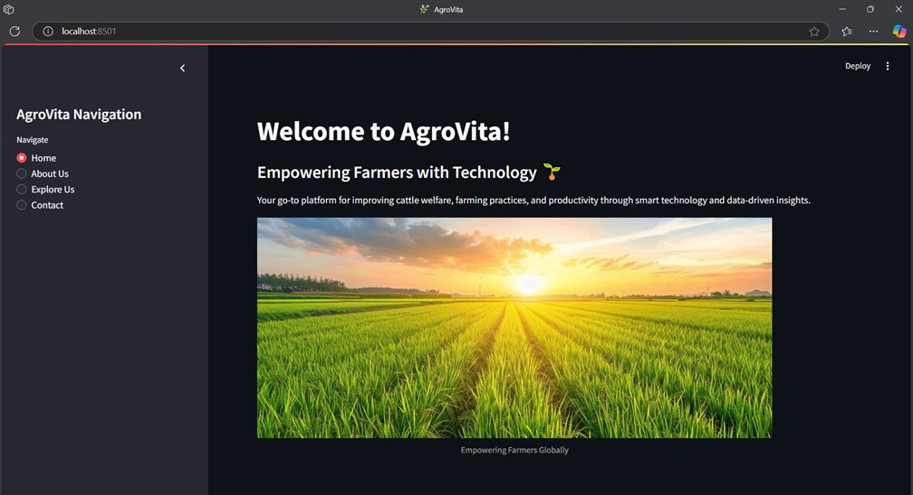
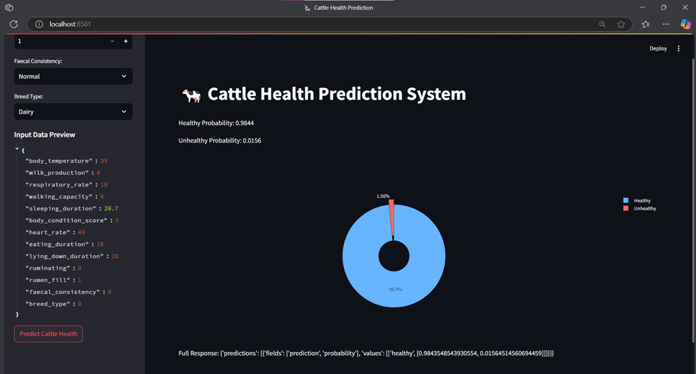
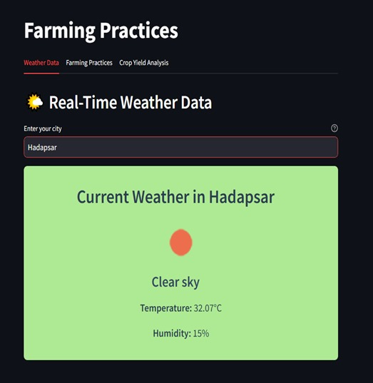
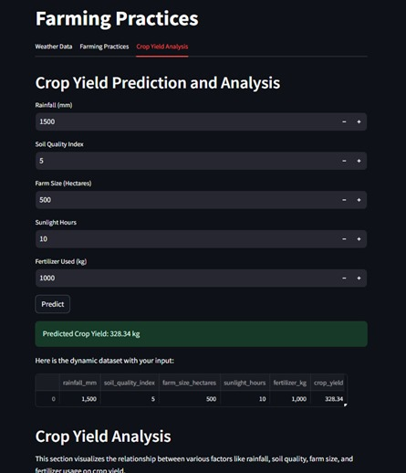
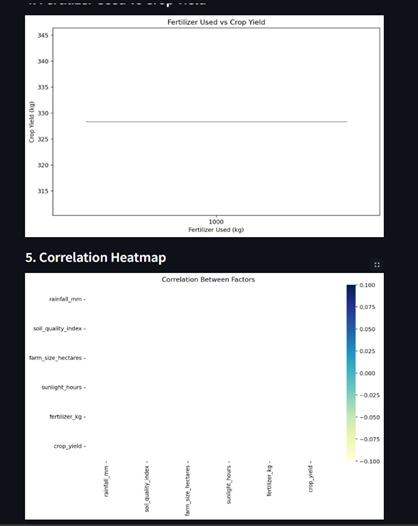

# AgroVita

## Overview
AgroVita is a comprehensive system aimed at analyzing cattle data to predict their health status and offer recommendations for maintaining their health. The system also includes real-time weather data, yield predictions, and visual tools to help boost cattle welfare and farm productivity. AgroVita encourages sustainable farming practices, helping farmers in the long run.

## Objectives
- **Health Prediction**: Analyze cattle data to predict their health status and offer timely recommendations.
- **Weather Data Integration**: Incorporate real-time weather data to support farmers in making informed decisions.
- **Yield Predictions**: Provide accurate predictions on crop yield to enhance farm productivity.
- **Sustainable Farming**: Promote sustainable farming practices to ensure long-term benefits for farmers and the environment.

## Social Impact
AgroVita addresses several critical social issues in India, including:
- Poor cattle health management.
- Lack of access to timely medical care for cattle.
- Low farm productivity.
- The need for sustainable farming practices.

By improving cattle health management and farm productivity, AgroVita aims to enhance the livelihood of farmers and ensure better animal welfare.

## Features
- **Health Monitoring**: Continuous monitoring of cattle health data.
- **Real-time Recommendations**: Provide actionable recommendations to farmers based on data analysis.
- **Weather Integration**: Display real-time weather data to assist farmers in planning.
- **Yield Prediction**: Use machine learning models to predict crop yield.
- **Visual Tools**: Offer visual tools and dashboards to present data insights clearly.

## Example Output
### Home Page


### Health Monitoring Dashboard


### Weather Data Integration


### Yield Prediction Results


### Yield Prediction Visualization Results


## Getting Started
1. **Clone the repository**:
    ```sh
    git clone https://github.com/ShreyaaNChavan/AgroVita.git
    ```
2. **Navigate to the project directory**:
    ```sh
    cd AgroVita
    ```
3. **Install dependencies** (if applicable):
    ```sh
    pip install -r requirements.txt
    ```
4. **Run the application**:
   

